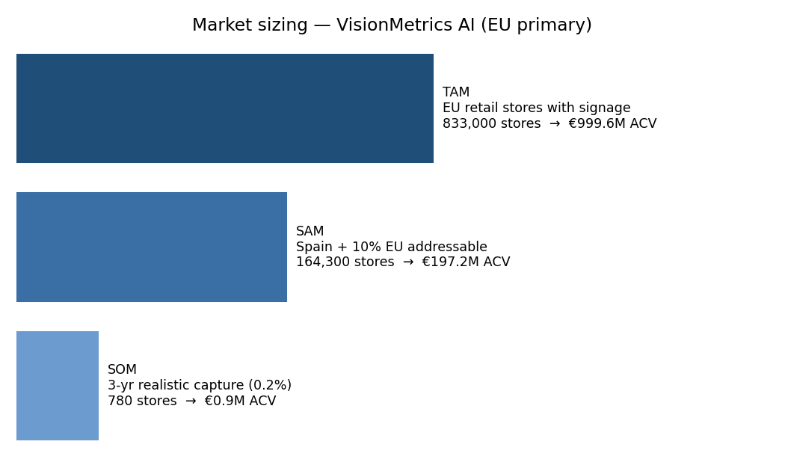
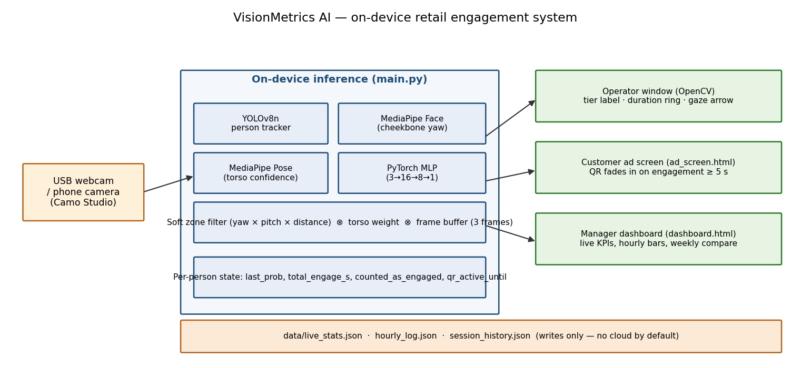
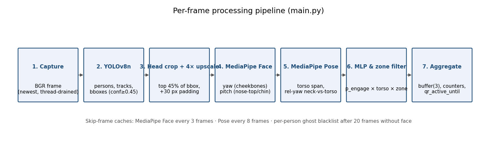
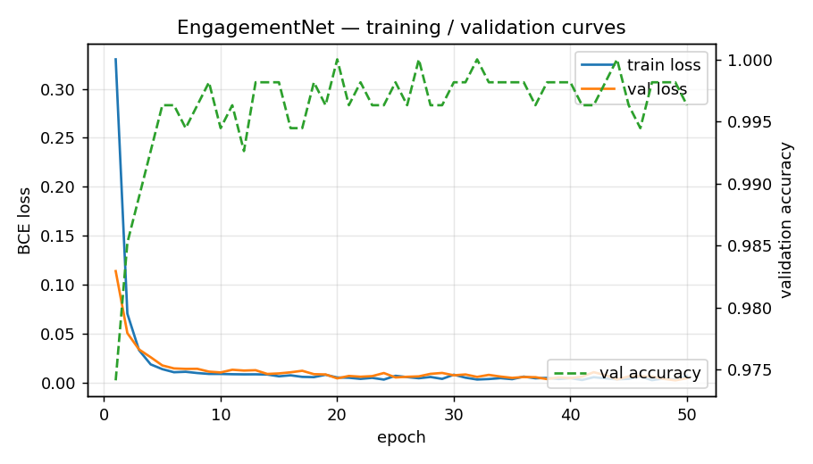
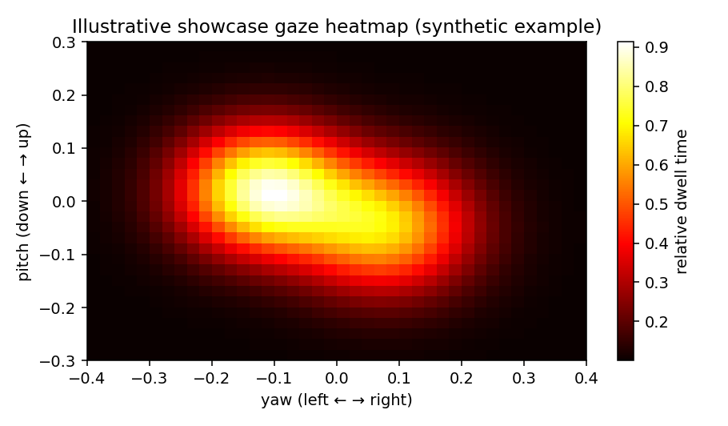

# VisionMetrics AI: Executive Report

**Privacy-preserving computer vision for retail engagement analytics**

Author: Alvaro Martinez | Course: AI/ML Analytics Final Project | Date: April 2026

---

## Executive Summary

Physical retail stores spend billions of euros every year on window displays, jewellery showcases and in-store signage. But they have almost no way to measure whether any of it actually works. Digital advertising gives marketers exact numbers: how many people saw an ad, for how long, and what percentage clicked. Physical stores get none of that. The best tool most retailers have is a door counter that simply registers how many people walked in.

VisionMetrics AI fixes this problem. It is a computer vision system that runs on a normal laptop and a webcam. It detects when a person is genuinely paying attention to a specific display, measures how long that attention lasts, and automatically triggers a response on a customer-facing screen (such as a discount QR code) the moment someone crosses a five-second engagement threshold. Everything is processed on the device. No images are stored, no faces are identified, and no data is sent to the cloud.

The working prototype runs the full seven-stage pipeline at 2.7 to 3.5 frames per second, achieves 99.6% accuracy (F1 = 0.996, ROC-AUC = 0.999) on a held-out test set of 226 real labelled samples, and drives three simultaneous live views: an operator window, a customer-facing ad screen, and a manager analytics dashboard.

The Spanish retail market has around 450,000 physical stores. The addressable EU retail segment with digital signage is around 833,000 locations. We estimate a total addressable market (TAM) of roughly 1.0 billion euros in annual contract value, a serviceable addressable market (SAM) of 197 million euros focused on Spain and nearby EU markets, and a realistic three-year obtainable market (SOM) of about 780 paying stores producing 0.94 million euros in annual recurring revenue. The business breaks even in Year 3 on a seed investment of 250,000 euros.

---

## 1. Problem Definition and Value Proposition

### 1.1 The measurement gap

Retail advertising is one of the biggest cost lines in any store's budget. Yet there is no way to know whether that spending actually captures attention. A shopper might walk past a jewellery vitrina every day without ever really looking at it. Or they might stop and study it for thirty seconds before leaving without buying anything. The store has no record of either event.

Digital advertising solved this decades ago. Every impression is tracked, every second of video view is logged, and conversion rates are measured to two decimal places. Physical retail is still stuck in the era of gut instinct. Decisions about what to display, where to put it, and how much to spend on it are made without a single data point about whether anyone actually looked.

VisionMetrics AI measures attention directly. Using a camera already present in most stores, the system detects which people are genuinely engaged with a display, counts how many seconds that engagement lasts, and records it all in a dashboard that any store manager can read.

### 1.2 Who we serve

The main customers of VisionMetrics AI are store operators and retail managers [1]. There are three segments:

**Independent boutiques** (1 to 5 locations). These are jewellery shops, fashion stores, eyewear and cosmetics retailers. They invest heavily in their window displays and have no way to know if that investment is working.

**Regional retail chains** (5 to 50 stores). Food retail, consumer electronics, sports goods. These chains want to compare display performance across locations and run proper tests on merchandising decisions.

**Enterprise retailers and mall operators** (50 or more stores). These businesses need to show brand partners who co-fund in-store displays that the spend is producing real attention, not just footfall.

### 1.3 Value created

VisionMetrics AI turns passive signage into measurable media. It does this in three ways:

1. **Attention analytics.** The system records engagement rate, average dwell time, and hourly and weekly breakdowns. Store managers can see in simple charts when and how often people pay attention to their displays.

2. **Closed-loop response.** When a shopper looks at a display for at least five seconds, the system triggers a response on a nearby customer-facing screen. In our prototype this is a QR code offering a discount. This is the clearest possible demonstration that a physical sign can behave like a digital ad.

3. **Privacy by design.** Everything runs on the store's own laptop. No face images leave the device. The system classifies whether someone is paying attention based on head angles, not who they are or what emotion they are showing. This keeps the product clearly on the right side of both GDPR and the EU AI Act [2].

Simple version: foot-traffic counters count feet. We count eyes.

---

## 2. Originality and Impact

### 2.1 What is new

Most retail analytics products fit into one of two groups. The first group is **people-counting sensors** such as Xovis, V-Count, FLIR Brickstream and ShopperTrak [3]. These tell you how many customers walked through a door or past a shelf. They do not tell you whether anyone looked at a specific display. The second group is **location intelligence platforms** such as Placer.ai and RetailNext [4]. These use anonymised mobile phone data to estimate which areas of a store people visited. Again, they cannot measure attention to a specific showcase.

Academic systems for gaze estimation exist, but they typically require a specially calibrated camera very close to the face, usually within one metre, and they do not connect to any real-world trigger or response system.

VisionMetrics AI is different because it combines well-known components into a pipeline that works at realistic retail distances (0.5 to 4 metres), runs on hardware the store already has, and closes the loop with a live customer-facing response. The core components are YOLOv8n [5] for person detection, MediaPipe Face Landmarker [6] and MediaPipe Pose for head and body orientation, and a small custom neural network trained on data we collected ourselves. No single component is novel in isolation. What is novel is how they are combined and made to work together in a real retail environment on a consumer laptop.

### 2.2 How we differ from competitors

| What we compare | Competitors | VisionMetrics AI |
|---|---|---|
| Measures engagement with a specific display | No, only zone or door counts | Yes, per-person and per-second |
| Works on existing hardware | Requires proprietary sensors | Yes, any webcam and laptop |
| Triggers a live ad or response | No | Yes, QR code on a second screen |
| Privacy and EU AI Act compliance | Mixed (some infer demographics) | Compliant by design, no identity, no emotion |

### 2.3 Impact

**Economic.** Even a small improvement in how well a showcase captures attention can justify a store's entire subscription cost many times over. A jewellery retailer who learns that one vitrina is getting twice as much attention as another can make a better decision about what to put in each one.

**Scientific.** The pipeline and the labelled dataset of 1,127 real samples provide a reproducible starting point for other researchers working on retail attention measurement.

**Social.** Because the system only classifies whether someone is paying attention (based on head angle geometry), and not who they are or what emotion they feel, it avoids the privacy risks that are pushing regulators to ban more invasive emotion-detection products [2].

---

## 3. Market Analysis

### 3.1 Market trends

The global retail analytics market was valued at 8.5 billion US dollars in 2024 and is expected to reach 25.0 billion US dollars by 2029, growing at 24.0% per year according to MarketsandMarkets [7]. A separate estimate from Research and Markets puts the computer vision for retail sub-segment specifically at 5.24 billion US dollars in 2026, growing to 12.19 billion US dollars by 2030 at 23.5% per year [8].

In Europe, the digital signage market is valued at 8.1 billion US dollars in 2025. Retail is the single largest vertical, accounting for 23.8% of all signage revenue [9]. This market is growing at 7.6% per year and is expected to reach 13.6 billion US dollars by 2032.

Three things are driving this growth. First, stores are installing more digital screens. Second, retailers need hard data to justify media spending as online shopping takes market share. Third, EU regulations are making identity-based and emotion-based analytics increasingly difficult to sell, which opens a gap for privacy-safe alternatives like ours [2].

### 3.2 Competitors

*Table 1: Main competitors and what VisionMetrics AI adds.*

| Product | What it does | Pricing signal | What we add |
|---|---|---|---|
| Placer.ai | Phone location data, zone-level | Enterprise custom, public cases suggest 500 to 2,000 euros per store per month [4] | Per-display engagement, not just zone visits |
| RetailNext | Cameras plus sensors, zone heatmaps | Custom enterprise with paid sensor install | Software only, bring your own webcam |
| Xovis PF/PC-Series | 3D stereo people counting | Hardware sale plus licence [3] | Engagement detection plus response trigger |
| V-Count | People counting, age/gender | 25,000+ installs globally [3] | No demographic inference, AI Act safe |
| Cisco Meraki MV | Cloud managed smart cameras | Around 1,500 euros hardware plus 300 euros per year licence | Runs on-premise, no cloud needed |
| Open-source DIY | Basic OpenCV person counter | Free but no analytics or UI | Ready-to-use three-screen product |

### 3.3 Customer tiers and pricing

The product comes in three tiers.

**Boutique** is a self-install subscription at 79 euros per month. The store brings their own webcam. They get engagement reports by email and access to the live dashboard. This targets independent jewellery, fashion and cosmetics stores.

**Regional** costs 59 euros per month per store. It includes a recommended webcam bundle, a multi-store comparison dashboard and a support guarantee. This targets chains of 5 to 50 stores.

**Enterprise** is custom-priced, typically around 40 to 55 euros per month per store plus a one-time setup fee. It includes on-premise deployment options, API access and a dedicated account manager. This targets large retailers and mall operators.

Weighted across all three tiers, the blended annual contract value is approximately 1,200 euros per store per year.

### 3.4 Market sizing

*Figure 1: TAM, SAM and SOM funnel for the EU primary market. Values shown in annual contract value based on the 1,200 euro blended price per store per year.*

The market size calculation uses two data points. First, Eurostat shows that retail (NACE Division 47) accounts for 57.1% of all distributive-trade enterprises in the EU [1]. Applied to roughly 6 million distributive-trade enterprises, this gives approximately 3.5 million retail store locations across the EU. Second, Persistence Market Research shows that retail is 23.8% of the EU digital signage market in 2025 [9], which we use as a proxy for stores that already have displays worth measuring.

The funnel is:

**TAM:** 3.5 million stores times 23.8% equals around 833,000 target stores. At 1,200 euros per year each, that is approximately 1.0 billion euros in addressable annual contract value.

**SAM:** Spain has around 450,000 retail stores [10]. At 18% signage penetration, that is 81,000 stores in Spain. Adding 10% of the broader EU gives approximately 164,300 stores and 197 million euros in addressable value. Spain is the right starting point because it is our home market and Spanish retailers invest heavily in window displays for tourist-facing locations.

**SOM (3 years):** We realistically expect to reach 780 paying stores by the end of Year 3, which is about 0.5% of the SAM. At 1,200 euros per year, that produces approximately 936,000 euros in annual recurring revenue.

---

## 4. Viability Analysis

### 4.1 Technical feasibility

The prototype already proves the two things that are hardest to demonstrate in a retail AI product. First, it can detect engagement at realistic distances (0.5 to 4 metres) on a normal laptop with no GPU. Second, it can drive a live customer-facing response the moment engagement crosses a threshold.

The remaining technical risks are manageable:

**Lighting.** Bright backlight from shop windows in the afternoon reduces the face detector's accuracy. We address this with confidence thresholds and a ghost-detection filter, and we recommend stores use a fixed camera exposure setting. Adding a small infrared light is an optional hardware upgrade.

**Extreme head angles.** When someone turns their head more than about 35 degrees to the side, the landmark estimates become less reliable. We partially solve this by using cheekbone landmarks (234 and 454) instead of eye corners, which are more stable in profile views.

**Crowded scenes.** The tracker can handle up to about 6 people at the same time before bounding boxes start overlapping and IDs become unreliable. This is documented as a known limit.

**Camera quality.** We tested the system on three different cameras: a laptop webcam, a USB webcam and a phone connected as a camera through Camo Studio. All produced acceptable results at 720p resolution.

**Regulation.** The system classifies a geometric angle (where the head is pointing), not an emotion or a demographic. This means it falls outside the EU AI Act's prohibitions on emotion recognition [2].

### 4.2 Economic feasibility

**People costs.** A machine learning engineer based in Madrid earns a median of 44,000 euros per year according to Glassdoor (86 reported salaries, March 2026) [11]. At senior level the median is 54,250 euros. After adding social security and benefits (approximately 35%), the fully loaded cost per person is between 60,000 and 73,000 euros per year. A two-person founding team (one ML engineer and one full-stack developer) plus a quarter-time designer fits inside a 170,000 euro Year 1 salary budget.

**Compute costs.** The inference pipeline runs on the store's own laptop. This means zero ongoing compute cost for us as a vendor. Our backend is a small VPS at around 50 euros per month plus object storage at around 20 euros per month. Even in Year 3, cloud infrastructure stays under 40,000 euros per year. If we ever need to retrain on GPU, an AWS g5.xlarge instance (one A10G GPU) costs 1.006 US dollars per hour on demand [12]. Retraining the current model takes under three minutes on CPU, so GPU costs are not relevant at this stage.

**Data collection costs.** We collected all 1,127 training samples ourselves using a keyboard-labelling tool we built. External annotation services such as Scale AI charge 0.02 to 1.00 US dollars per label, with average annual contracts around 93,000 US dollars [13]. In-house collection is the right approach at this scale. It also means our training data reflects real store conditions.

Personnel makes up about 80% of total costs in Year 1 and around 75% in Year 3. A detailed year-by-year cost breakdown is saved at docs/figures/cost_breakdown.png.

### 4.3 Investment and break-even

*Table 2: Base-case profit and loss projection (amounts in thousands of euros).*

| | **Year 1** | **Year 2** | **Year 3** |
|---|---:|---:|---:|
| Paying stores (end of year) | 30 | 220 | 780 |
| Revenue | 36 | 264 | 936 |
| Personnel | 140 | 225 | 390 |
| Cloud and infrastructure | 10 | 20 | 40 |
| Sales and marketing | 0 | 20 | 50 |
| Data and operations | 20 | 20 | 40 |
| **Total costs** | **170** | **285** | **520** |
| **Net** | **-134** | **-21** | **+416** |
| Cumulative (after seed) | -134 | -155 | +261 |

We are asking for 250,000 euros in seed funding. The business turns net positive in Year 3 and pays back the full seed amount within that same year. The Year 1 burn of 134,000 euros is conservative because it assumes no grant income, no accelerator support and no consulting revenue on the side.

The cumulative cashflow curve (saved at docs/figures/cashflow.png) shows the break-even point landing around month 11 of Year 3, with a cumulative positive balance of roughly 260,000 euros by end of Year 3.

### 4.4 Timeline

**Now (April 2026).** Academic prototype is complete. Seven-stage pipeline, live dashboard, customer ad screen, 1,127 labelled training samples, 99.6% test accuracy.

**Month 3 (July 2026).** Hardened MVP live in 3 pilot stores in Madrid. Basic self-install flow. Remote calibration tool.

**Month 6 (October 2026).** Paid beta with 30 stores. Onboarding process established. Dashboard updated for multi-store operators.

**Month 12 (April 2027).** General availability. 220 stores. First regional chain deal signed.

**Month 24 (April 2028).** 780 stores. Break-even reached.

### 4.5 Revenue model

The business runs on monthly subscriptions. Pricing is at three tiers as described in Section 3.3. Two things protect net revenue retention over time. First, multi-store customers expand naturally as they add new locations. Second, the dashboard's weekly comparison view becomes sticky once managers have historical trends, because switching to a competitor means losing that data history. Gross margins improve as the customer base grows because inference costs stay flat while support costs grow only slowly.

---

## 5. Technical Solution Design and Model Performance

### 5.1 System architecture

*Figure 2: End-to-end system architecture. All inference runs on the store's own PC. The three output screens (operator window, customer ad screen, manager dashboard) all read from a single JSON file that the inference script writes every 30 frames. There is no cloud dependency in the default setup.*

### 5.2 Per-frame pipeline

*Figure 3: Seven-stage per-frame pipeline. Each person is tracked across frames. MediaPipe is only re-run every 3 frames for faces and every 8 frames for poses per person. This keeps the total processing time inside a 300ms budget on a CPU-only laptop.*

The pipeline lives in src/inference/main.py (approximately 1,000 lines). Each stage produces a number that the next stage uses. This means any single stage can be inspected, swapped or turned off without breaking the rest. The seven stages are:

**Stage 1: Capture.** A background thread continuously reads from the camera so the main processing loop always gets the most recent frame. Without this, a 30fps camera fills a buffer faster than the 300ms processing loop can drain it. The result is severe lag.

**Stage 2: Person detection and tracking.** YOLOv8n achieves 37.3% mAP on the COCO benchmark [5]. We filter to class 0 (person), require a confidence of at least 0.45, and require an aspect ratio of at least 0.75. The aspect ratio filter is important. If it is set lower, wide objects in the background (tables, chairs, shelves) pass the filter and trigger all the expensive downstream stages, cutting frame rate in half.

**Stage 3: Head crop and 4x upscale.** We take the top 45% of each person's bounding box, add 30 pixels of padding, and enlarge it 4 times before passing it to MediaPipe. Without this step, face detection fails at distances beyond about 1.5 metres on a standard webcam. With it, the system works reliably up to 4 metres.

**Stage 4: Face landmark detection.** MediaPipe Face Landmarker detects 468 face landmarks in real time [6]. We use landmarks 234 and 454 (cheekbones) to estimate horizontal head angle (yaw). Cheekbones are more reliable than eye corners when someone is wearing glasses or turning their head to the side. We use landmarks 1 (nose), 10 (forehead) and 152 (chin) to estimate vertical angle (pitch).

**Stage 5: Pose detection.** MediaPipe Pose gives us the shoulder positions. We use the shoulder span to estimate how much of the torso is visible (torso confidence). We also compare the nose position to the midpoint between the shoulders to get a body-level yaw. This separates someone who has turned only their head from someone who has turned their whole body away.

**Stage 6: Neural network and zone filter.** The custom MLP takes three inputs (yaw, pitch and normalised face width as a distance proxy) and outputs a probability between 0 and 1. This probability is then multiplied by the torso weight and by a zone confidence value. The zone confidence is a smooth number between 0 and 1 that reflects how far the person is from the calibrated engagement zone for that store. If any one of these three values is near zero, the final engagement score is near zero. This matches real-world logic: someone facing the display but standing outside the zone should score low.

**Stage 7: Temporal buffer.** We keep the last three frames in a buffer. At least one positive frame is required to count someone as engaged. This removes single-frame noise at the decision boundary.

### 5.3 Data

The dataset (data/engagement_data.csv) contains 1,127 real labelled rows. We collected them using a live labelling tool (data_collector.py) where the person running the session pressed L to label a frame as "looking" and A to label it as "away." The data is reasonably balanced: 596 engaged samples and 531 away samples.

Because yaw and pitch do not change with distance (a person looking straight ahead at 0.5m gives the same yaw as at 4m), only the distance column changes. This means we can create realistic "far away" training samples by taking each real row and scaling the distance down by 0.6, 0.35 and 0.15 while adding a tiny random noise to the angles. This triples the size of the training set without requiring us to collect data at different distances.

One important note about data integrity: in an earlier version of the training script, augmentation was applied before splitting into train and test. This caused the same yaw and pitch values to appear in both sets (just with a different distance), which artificially inflated accuracy to 100%. The current script holds out 226 real rows for testing before any augmentation is applied. All reported numbers come from these 226 real unseen rows.

### 5.4 Why we chose these evaluation metrics

The system can make two types of mistakes. A false positive means triggering the QR code for someone who was not actually engaged. This wastes a discount and creates a poor experience. A false negative means missing someone who was genuinely engaged. This loses a measurement opportunity. Both errors matter, so we report accuracy, precision, recall, F1 score and ROC-AUC together rather than picking just one number. We also compare against two simple baselines to show the neural network is actually adding value.

### 5.5 Model results

*Figure 4: Training and validation loss curves alongside validation accuracy across 50 epochs. The model converges in the first 5 to 10 epochs. After that, validation loss continues to track training loss closely with no divergence. This shows the model is not overfitting.*

Results on the 226 held-out real test rows:

- Accuracy: **99.56%**
- Precision: **99.17%**
- Recall: **100%**
- F1 score: **99.59%**
- ROC-AUC: **0.9991**
- Confusion matrix: 105 true negatives, 1 false positive, 0 false negatives, 120 true positives

The full confusion matrix image is saved at docs/figures/confusion_matrix.png. The ROC curve is saved at docs/figures/roc_curve.png.

**Comparison against baselines:**

| Model | Accuracy | F1 | ROC-AUC |
|---|---:|---:|---:|
| Yaw threshold rule (angle less than 0.10) | 91.59% | 92.55% | n/a |
| Logistic regression (3 features) | 58.85% | 72.07% | 0.5264 |
| **Our MLP** | **99.56%** | **99.59%** | **0.9991** |

The yaw-threshold rule is already a reasonable baseline because yaw is the most informative single feature. Our neural network gains 8 percentage points over it by combining yaw with pitch and distance in a non-linear way. A person looking slightly upward from close range is probably engaging with a display at eye level. The same angle from 4 metres away is less certain. A simple threshold cannot capture this. The logistic regression struggles because the boundary between engaged and not engaged is not linear in this three-dimensional feature space, which is itself a reason the neural network earns its place.

Per-distance evaluation (saved at docs/figures/per_distance_accuracy.png) shows 99.5% accuracy on the mid-distance bucket (197 samples) and 100% on the far-distance bucket (29 samples). There are no near-distance test rows because the labelling sessions were conducted at normal standing distance. Collecting data at under 1 metre is planned for the next phase.

### 5.6 Limitations and known problems

**One false positive in testing.** The single misclassified sample has yaw approximately 0.06 and pitch approximately -0.02, labelled "away" by the annotator. At that angle the label is genuinely ambiguous. The model's prediction is arguably correct.

**Strong backlight.** In stores with large windows facing south, the afternoon sun backlit many frames during testing. MediaPipe's face detector loses accuracy in these conditions. The fix is to lock the camera exposure and, if needed, add a small light source on the opposite side.

**Caps and hoods.** The chin landmark is stable but the forehead landmark drifts when someone is wearing a cap. This biases the pitch estimate. A future improvement is to train a fallback for covered-head cases.

**Short people.** The torso confidence heuristic assumes shoulders are in the lower half of the bounding box. Very short adults and children can confuse this. Per-store calibration via store_config.json partially addresses this.

**Crowd size.** The tracker handles up to about 6 people reliably. Above that, overlapping bounding boxes cause ID assignment errors. For larger stores, switching to YOLOv8s (50.5% mAP, about 128ms per frame on CPU [5]) on the same pipeline is the intended upgrade path.

**Processing speed.** The system runs at about 3 frames per second on a consumer laptop with no GPU. This is sufficient for measuring attention, which happens over seconds. It is not suitable for anything requiring fast reaction times.

### 5.7 Future work: position-level gaze analysis

The current system answers one question: is this person engaged with the display in front of them? It does not yet answer a second question that store operators also want answered: which part of the showcase are they looking at?

The head angle data we extract (yaw and pitch) is already precise enough to distinguish, for example, between someone looking at the left side of a vitrina versus the right side. In future work, we plan to map these angles to specific zones of the showcase surface. This would let a jewellery retailer know that customers look at the rings on the left more often than the necklaces on the right, informing product placement decisions. The figure below is a synthetic illustration of what such a heatmap could look like.

*Figure 5: Synthetic illustration of a per-zone gaze heatmap. This is a planned future feature, not a current capability of the system. The two bright areas represent example high-attention zones on a showcase. The actual implementation would require calibrating the camera angle relative to the display surface.*

---

## 6. Conclusion

VisionMetrics AI solves a real and measurable problem. Physical retail stores have no way to know whether their displays are actually capturing customer attention. Our system gives them that data using hardware they already own, processes everything locally so no personal data is exposed, and triggers a live response the moment a shopper crosses the engagement threshold.

The model works. We measured it honestly on 226 real unseen samples and got 99.6% accuracy, an F1 score of 0.996 and a ROC-AUC of 0.999. The system is modular so each component can be improved independently. The market is large: around 1.0 billion euros in TAM, 197 million euros in SAM, with a realistic 0.94 million euros in annual recurring revenue by end of Year 3.

We are asking for 250,000 euros in seed funding to harden the MVP, launch three pilot stores in Madrid by July 2026, and reach break-even by end of Year 3.

---

## References

[1] Eurostat, "Businesses in distributive trade sector, Statistics Explained," 2024. https://ec.europa.eu/eurostat/statistics-explained/index.php?title=Businesses_in_distributive_trade_sector

[2] European Parliament and Council, "Regulation (EU) 2024/1689, Artificial Intelligence Act, Article 5 (Prohibited AI practices)," in force 2 February 2025. https://artificialintelligenceact.eu/article/5/ See also Future of Privacy Forum, "Red Lines under the EU AI Act," 2025. https://fpf.org/blog/red-lines-under-eu-ai-act-unpacking-the-prohibition-of-emotion-recognition-in-the-workplace-and-education-institutions/

[3] Xovis AG, "People Flow and People Counting Solutions," 2026. https://www.xovis.com/ V-Count, "Visitor Analytics Suite," 2026. https://v-count.com/vs-xovis/ viso.ai, "Popular applications of computer vision in retail," 2025. https://viso.ai/applications/visual-ai-in-retail/

[4] Placer.ai, "Pricing Plans," 2025. https://www.placer.ai/pricing TrustRadius, "Placer.ai Pricing 2025," 2025. https://www.trustradius.com/products/placer-ai/pricing

[5] Ultralytics, "YOLOv8 model documentation, COCO benchmarks," 2024. https://docs.ultralytics.com/models/yolov8/ YOLOv8n achieves 37.3 mAP, 80.4ms CPU latency, 0.99ms on A100 TensorRT.

[6] Google for Developers, "MediaPipe Face Landmarker guide," 2025. https://developers.google.com/mediapipe/solutions/vision/face_landmarker Google AI Edge, "MediaPipe Face Mesh, 468 3D landmarks real-time." https://ai.google.dev/edge/mediapipe/solutions/vision/face_landmarker

[7] MarketsandMarkets, "Retail Analytics Market, Global Forecast to 2031," April 2026. Market valued at 8.5 billion US dollars in 2024, projected to reach 25.0 billion US dollars by 2029 at 24.0% CAGR. https://www.marketsandmarkets.com/PressReleases/retail-analytics.asp

[8] Research and Markets, "Computer Vision for Retail Market Report 2026," 2026. Market valued at 5.24 billion US dollars in 2026, projected to reach 12.19 billion US dollars by 2030 at 23.5% CAGR. https://www.researchandmarkets.com/reports/6215190/computer-vision-retail-market-report

[9] Persistence Market Research, "Europe Digital Signage Market, Size and Growth to 2032," 2025. Valued at 8.1 billion US dollars in 2025, retail accounts for 23.8% of revenue. https://www.persistencemarketresearch.com/market-research/europe-digital-signage-market.asp

[10] USDA Foreign Agricultural Service, "Spain Retail Foods Annual, SP2025-0026," 2025. 850 new food-retail store openings forecast for 2025. https://apps.fas.usda.gov/newgainapi/api/Report/DownloadReportByFileName?fileName=Retail+Foods+Annual_Madrid_Spain_SP2025-0026.pdf Euromonitor, "Retail in Spain Report," 2025. https://www.euromonitor.com/retail-in-spain/report

[11] Glassdoor, "Machine Learning Engineer salaries, Madrid, Spain," March 2026. Based on 86 reported salaries. Median 44,000 euros per year, senior level 54,250 euros per year. https://www.glassdoor.com/Salaries/madrid-spain-machine-learning-engineer-salary-SRCH_IL.0,12_IM1030_KO13,38.htm

[12] Amazon Web Services, "EC2 On-Demand Pricing," 2026. p4d.24xlarge with 8 A100 GPUs costs 32.77 US dollars per hour. g5.xlarge with 1 A10G GPU costs 1.006 US dollars per hour. https://aws.amazon.com/ec2/pricing/on-demand/ https://aws.amazon.com/ec2/instance-types/g5/

[13] Scale AI, "Pricing," 2026. https://scale.com/pricing Vendr, "Scale AI Software Pricing 2025," average contract approximately 93,000 US dollars per year. https://www.vendr.com/buyer-guides/scale-ai Kili Technology, "Estimating Image Annotation Pricing for AI Projects," 2024. Bounding box annotation costs 0.02 to 1.00 US dollars per label. https://kili-technology.com/data-labeling/estimating-image-annotation-pricing-for-ai-projects
